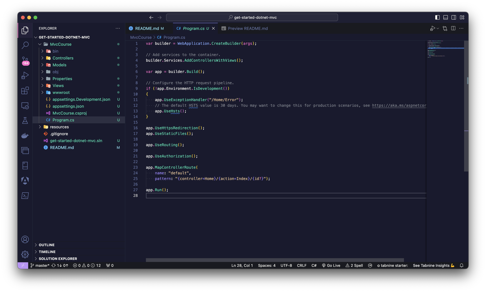
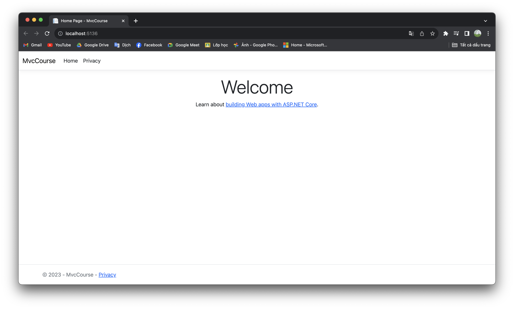
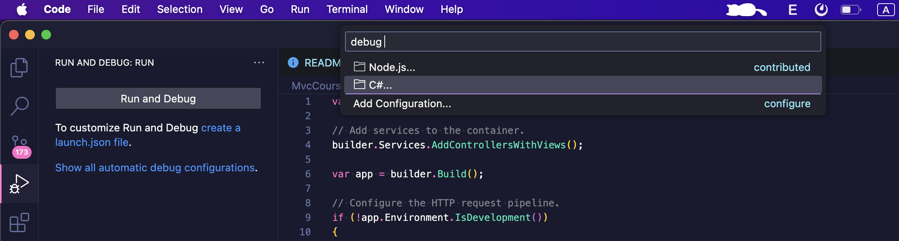
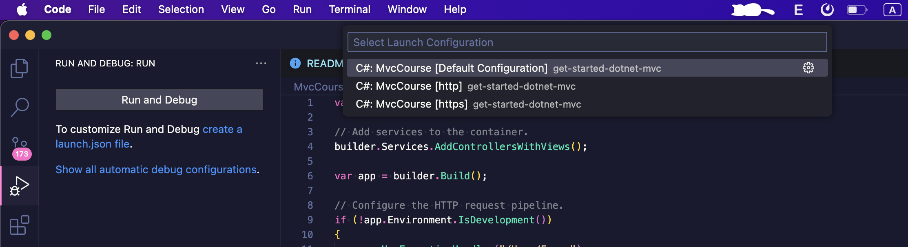
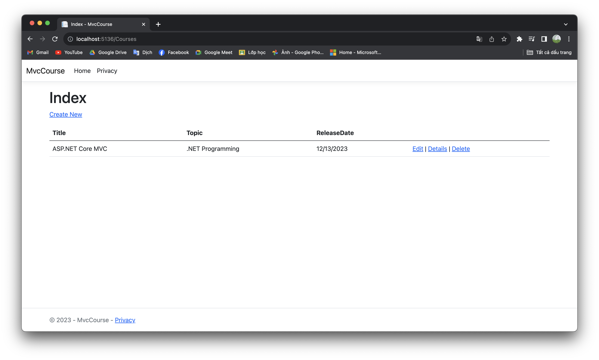
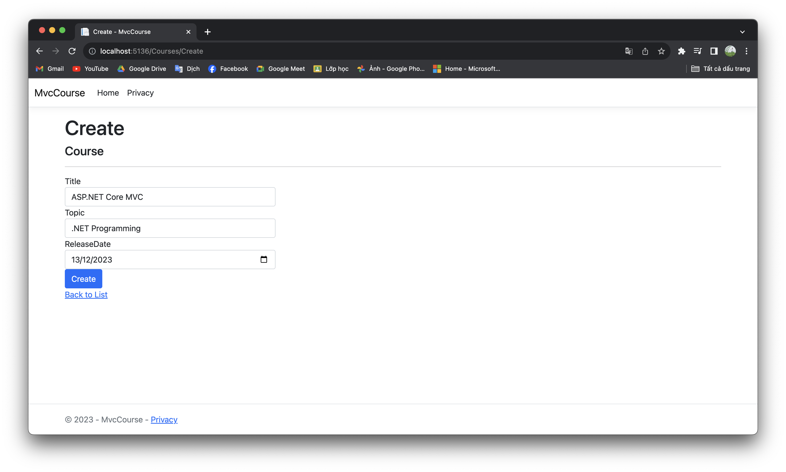
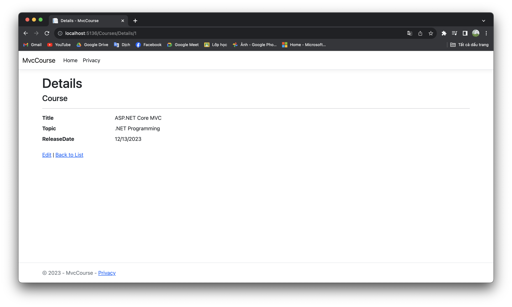
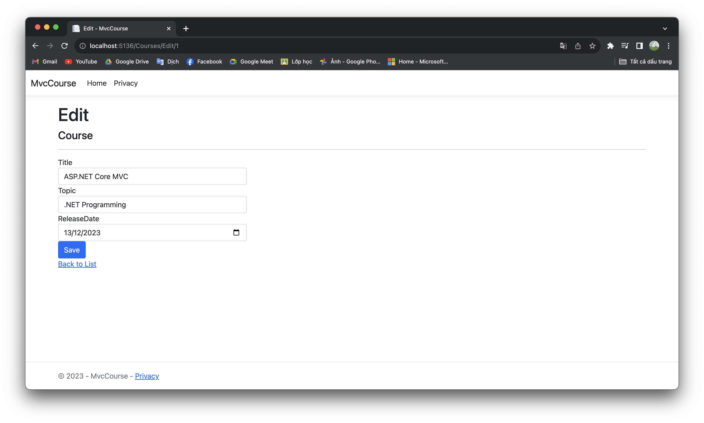
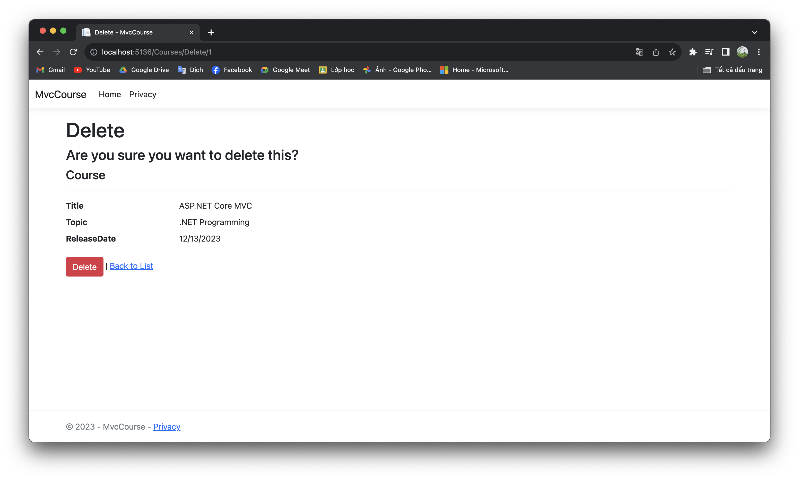

# Part 2: Get started with ASP.NET Core Mvc, Connect to SQL Server database to CRUD

>This tutorial teaches ASP.NET Core Mvc web development with models, controllers, and views. Initialize an Mvc app and connect to SQL Server database to CRUD. This guide is compiled based on [Get started with ASP.NET Core Mvc](https://learn.microsoft.com/en-us/aspnet/core/tutorials/first-mvc-app/start-mvc?view=aspnetcore-8.0&tabs=visual-studio-code) by `Microsoft`.

At the end of the series, you'll have an app that manages and displays course data. You learn how to:

- [x] Create a web app.
- [x] Add and scaffold a model.
- [x] Work with a database.
- [x] Implement CRUD.

If you do not have a development environment, you can refer to [Install .NET and SQL Server environment in Visual Studio Code](https://github.com/NguyenPhuDuc307/install-dotnet-sql-server).

## Install .NET

- **Step 1: Download and install [.NET SDK](https://dotnet.microsoft.com/en-us/download).**
  Prioritize choosing a stable version with `long-term support`.
  
- **Step 2: Check for successful installation**
  run the following command:

  ```bash
  dotnet --version
  ```

## Create and run a web app

- **Initialize the .NET Mvc project**
  run the following command:

  ```bash
  dotnet new mvc -o CourseManagement
  ```

  The dotnet new command creates a new ASP.NET Core Mvc project in the CourseManagement folder.

  

- **Trust the HTTPS development certificate** by running the following command:

  ```bash
  dotnet dev-certs https --trust
  ```

- **Run app** by running the following command:

  ```bash
  dotnet run
  ```

  or

    ```bash
  dotnet watch run
  ```

  - Launches a browser.
  - Navigates to ```https://localhost:<port#>```

  

  To finish, use the combination `Control/Command + C`

  > **Additionally**, you can use VSC's run and debug function

  Click RUN AND DEBUG, continue click choose `Show all automatic debug configurations`:

  

  Choose **C#: CourseManagement [Default Configuration]**:

  

## Add a model to an ASP.NET Core Mvc app

>In this tutorial, classes are added for managing courses in a database. These classes are the "Model" part of the Mvc app.
>These model classes are used with [Entity Framework Core (EF Core)](https://learn.microsoft.com/en-us/ef/core) to work with a database. EF Core is an object-relational mapping (ORM) framework that simplifies the data access code that you have to write.

- **Add a data model class**

  Add a file named `Course.cs` to the `Data/Entities` folder, create it in your project's source folder.

  Update the Data/Entities/Course.cs file with the following code:

  ```c#
  using System.ComponentModel.DataAnnotations;

  namespace CourseManagement.Data.Entities;

  public class Course
  {
      public int Id { get; set; }
      public string? Title { get; set; }
      public string? Topic { get; set; }
      [DataType(DataType.Date)]
      public DateTime ReleaseDate { get; set; }
  }
  ```

  The question mark after string indicates that the property is nullable. For more information, see [Nullable reference types](https://learn.microsoft.com/en-us/dotnet/csharp/nullable-references).

- **Add NuGet packages**

  Run the following .NET CLI commands:

  ```c#
  dotnet tool uninstall --global dotnet-aspnet-codegenerator
  dotnet tool install --global dotnet-aspnet-codegenerator
  dotnet tool uninstall --global dotnet-ef
  dotnet tool install --global dotnet-ef
  dotnet add package Microsoft.EntityFrameworkCore.Design
  dotnet add package Microsoft.VisualStudio.Web.CodeGeneration.Design
  dotnet add package Microsoft.EntityFrameworkCore.SqlServer
  dotnet add package Microsoft.EntityFrameworkCore.Tools
  ```

  >**Note** The version of the tool and package must be equal to the dotnet version. refer to [Create .NET apps faster with NuGet](https://www.nuget.org/)

  Check the installed packages in `CourseManagement.csproj`

- **Add a database context**

  The database context is the main class that coordinates Entity Framework functionality for a data model. This class is created by deriving from the Microsoft.EntityFrameworkCore.DbContext class.

  Add a `CourseDbContext.cs` file to the `Data` folder.

  ```c#
  using Microsoft.EntityFrameworkCore;
  using CourseManagement.Data.Entities;

  namespace CourseManagement.Data;

  public class CourseDbContext : DbContext
  {
      public CourseDbContext(DbContextOptions<CourseDbContext> options)
          : base(options)
      {
      }

      public DbSet<Course> Courses { get; set; } = null!;
  }
  ```

- **Register the database context**

  In ASP.NET Core, services such as the DB context must be registered with the dependency injection (DI) container. The container provides the service to controllers.

  Add the following code to `Program.cs`:

  ```c#
  builder.Services.AddDbContext<CourseDbContext>(options =>
      options.UseSqlServer(builder.Configuration.GetConnectionString("CourseDbContext") ?? throw new InvalidOperationException("Connection string 'CourseDbContext' not found.")));
  ```

  Result:

  ```c#
  using Microsoft.EntityFrameworkCore;
  using CourseManagement.Data;

  var builder = WebApplication.CreateBuilder(args);
  builder.Services.AddDbContext<CourseDbContext>(options =>
      options.UseSqlServer(builder.Configuration.GetConnectionString("CourseDbContext") ?? throw new InvalidOperationException("Connection string 'CourseDbContext' not found.")));

  // Add services to the container.
  builder.Services.AddControllersWithViews();

  var app = builder.Build();

  // Configure the HTTP request pipeline.
  if (!app.Environment.IsDevelopment())
  {
      app.UseExceptionHandler("/Home/Error");
      // The default HSTS value is 30 days. You may want to change this for production scenarios, see https://aka.ms/aspnetcore-hsts.
      app.UseHsts();
  }

  app.UseHttpsRedirection();
  app.UseStaticFiles();

  app.UseRouting();

  app.UseAuthorization();

  app.MapControllerRoute(
      name: "default",
      pattern: "{controller=Home}/{action=Index}/{id?}");

  app.Run();

  ```

  Adds a database connection string to the `appsettings.Development.json` file.

  ```json
  "ConnectionStrings": {
    "CourseDbContext": "Server=localhost;Database=CourseManagement;User Id=sa;password=Password.1;Trusted_Connection=False;MultipleActiveResultSets=true;Encrypt=False"
  }
  ```

  You can change `Password.1` to another password you want.

## Scaffold course controller and pages

Open a command window in the project directory. The project directory is the directory that contains the `Program.cs` and `.csproj` files.

On macOS and Linux, export the scaffold tool path:

```bash
export PATH=$HOME/.dotnet/tools:$PATH
```

Run the following command:

```bash
dotnet aspnet-codegenerator controller -name CoursesController -m Course -dc CourseManagement.Data.CourseDbContext --relativeFolderPath Controllers --useDefaultLayout --referenceScriptLibraries
```

**Scaffolding creates the following:**

- A courses controller: `Controllers/CoursesController.cs`
- Razor view files for **Create**, **Delete**, **Details**, **Edit**, and **Index** pages: Views/Courses/*.cshtml

The automatic creation of these files and file updates is known as scaffolding.

**Initial migration:**

Use the EF Core Migrations feature to create the database. Migrations is a set of tools that create and update a database to match the data model.

Run the following .NET CLI commands:

```bash
dotnet ef migrations add InitialCreate -o Data/Migrations
```

```bash
dotnet ef database update
```
  
- `ef migrations add InitialCreate`: Generates a `Migrations/{timestamp}_InitialCreate.cs` migration file. The `InitialCreate` argument is the migration name. Any name can be used, but by convention, a name is selected that describes the migration. This is the first migration, so the generated class contains code to create the database schema. The database schema is based on the model specified in the `CourseManagementContext` class, in the `Data/CourseManagementContext.cs` file.
- `ef database update`: Updates the database to the latest migration, which the previous command created. This command runs the `Up` method in the `Migrations/{time-stamp}_InitialCreate.cs` file, which creates the database.

**Run the application to test functions:**

Run the following command:

```bash
dotnet watch run
```

- Launches a browser.
- Navigates to ```https://localhost:<port#>/Courses```

  Page Index:

  

  Page Add:

  

  Page Details:

  

  Page Edit:

  

  Page Delete:

  

- Modify _Layout.cshtml in Views/Shared/Layout.cshtml:

  Add the following code:

  ```html
  <li class="nav-item">
      <a class="nav-link text-dark" asp-area="" asp-controller="Courses"
          asp-action="Index">Courses</a>
  </li>
  ```

Above is the complete guide on get started with ASP.NET Core Mvc, Connect to SQL Server database to CRUD. Refer to [Get started with ASP.NET Core Mvc](https://learn.microsoft.com/en-us/aspnet/core/tutorials/first-mvc-app/start-mvc?view=aspnetcore-8.0&tabs=visual-studio-code) by `Microsoft`.

Next let's [Add a new field and add validation to an ASP.NET Core Mvc app](https://github.com/NguyenPhuDuc307/add-field-and-validation).
